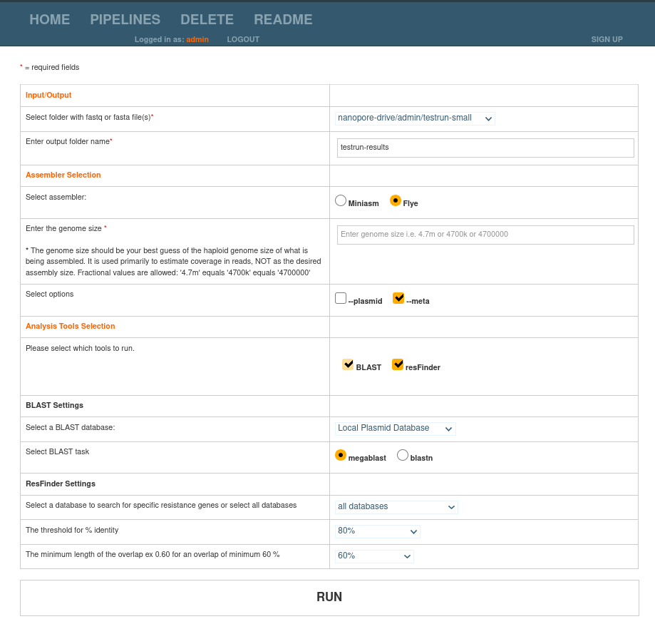

# WeFaceNano

[Installation](#how-to-install)

[Usage](#plasmid-pipeline-usage)

[Example Run](#example-run)

[Results](#results)

[Dependencies](#dependencies)


Disclaimer: The quality of the assembly relies on several factors. The quality and amount of the input DNA, the library kit used, the sequence coverage, and assembly parameters and options chosen may influence the final result and interpretation.  

## How to run

We offer two options for installing WeFaceNano, via Makefile (using Conda for dependencies), or via Docker.


### From Source

1. Clone the latest version of WeFaceNano from GitHub:
   ```bash
   git clone https://github.com/ErasmusMC-Bioinformatics/WeFaceNano
   ```
2. Move inside the WeFaceNano folder:
   ```
   cd WeFaceNano
   ```

3. Install [Conda](https://docs.conda.io/projects/conda/en/latest/user-guide/install/) (this will install miniconda):
   ```
   make install-conda
   ```
   - Note: his step can be skipped if you already have conda installed on your system


4. Install the conda environment using the environment.yml file
   ```bash
   make create-env
   ```

5. Install the reference databases:
   ```bash
   make install
   ```

5. Start WeFaceNano:
   ```bash
   make run
   ```

6. Open a browser, and navigate to [127.0.0.1:8008](http://127.0.0.1:8008).

7. Log in using the default admin credentials:
   ```
   username: admin
   password: admin
   ```

### With Docker

1. Install Docker according to the [official installation instructions](https://docs.docker.com/get-docker/)
   - Docker can be installed on Linux, Mac and Windows

2. Run the WeFaceNano Docker image with the following command

   ```
   docker run -p 8008:8008 quay.io/erasmusmc_bioinformatics/wefacenano
   ```

3. Open a browser, and navigate to [127.0.0.1:8008](http://127.0.0.1:8008).

4. Log in using the default admin credentials:
   ```
   username: admin
   password: admin
   ```


### Example run

In this section, we will guide you through running a pipeline on some testdata (this data is included in the Docker image)


1. First, we download some test data (~150MB; data from [Lin et al. 2017](http://gigadb.org/dataset/100387)):
   ```
   make download-testdata
   ```
2. Go to WeFaceNano [127.0.0.1:8008](https://127.0.0.1:8008), and make sure you are logged in as admin (username: `admin`, password: `admin`)

3. Click on `Pipelines` in the top menu bar

4. Configure the workflow
  - Select the input folder `testdata-small`
  - Choose a name for the results directory
  - Select `miniasm` as the assembler
  - Check the box for `BLAST` tool
  - Leave everything else on the default settings:
    

5. Click **Run**

6. The pipeline will take quite some time to complete
  - You can view the progress in the terminal

7. Once the pipeline has finished, you will be able to view the results in the webpage from the homepage.

8. In the results page, choose the sample you are interested in to view the output report, it should look something like this:
  


### Configuring WeFaceNano

The above instructions will run WeFaceNano with the default settings, but in practice, you may want to change some settings to fit your needs:

1. Configure a location for the user data
   - This defautls to `nanopore-drive`
   - This can be changed by editing the `settings.py` file and updating the `NANOPORE_DRIVE` variable.
   - This should be a location you can easily share with all users


   ```
9. Open a browser, and navigate to [127.0.0.1:8008](http://127.0.0.1:8008).


## Plasmid Pipeline Usage

To start using the Nanopore pipeline, users need an account, which can be by a superuser (admin).

If you are logged in as a superuser, a new user can be created by clicking the sign up button and entering a username and password.
When the new user is created, a new folder will appear on the nanopore drive with this username.

This drive can be mounted on the user's local machine and new data can be added using that mounted drive.

The default drive will be `nanopore-drive` (inside the WeFaceNano folder). In the Nanopore drive folder, the data structure should be something like:

```text
[username]
    |
    |---> Run01 (barcoded)
    |       |
    |       |---> BC01
    |       |      |---> reads01.fastq
    |       |      |---> reads02.fastq
    |       |      |---> ...
    |       |---> BC02
    |       |      |---> reads01.fastq
    |       |      |---> reads02.fastq
    |       |      |---> ...
    |       |---> BC..
    |              |---> ...
    |
    |---> Run02 (not barcoded FASTQ)
    |       |
    |       |---> fastq
    |               |---> reads01.fastq
    |               |---> reads02.fastq
    |               |---> ...
    |
    |---> Run ...
```

Once the data has been put in the user's folder, start
Click on the `Pipelines` menu button at the top of the screen to start.

Select FAST5 if you want to basecall using Albacore 2. If you want to skip the basecalling because you already have the FASTQ files, please select the FASTQ option. Select the project folder and enter a name for your output folder. This folder will be created in the results folder on the network drive. Using the default settings the results will be stored in this folder: <b>/mnt/d/Nanopore/[username]/results/</b>. When using a different path the results will be stored in that location.

When selecting the FASTQ option the Albacore basecalling step will be skipped and Flye or Miniasm will use the inputfolder to start the assembly. For the Flye assembly, please enter the genome size. Try to guess if you don't know the exact size. For Miniasm this step can be skipped. If the run is barcoded the tool will run for all barcodes and will calculate the optimal kmer-size for all barcodes. After the Miniasm assembly the Simple-Circularise tool will look for repeats and will try to circularise the contigs.

The plasmid pipeline can run two additional tools (BLAST and resfinder). Please check the tools you want to run during the pipeline.

When the BLAST option is selected, please select the database you want to use (It is possible to use the remote nt/nr database, a local nt/nr database or a local plasmid database). To use a local database please make sure the database is on the mounted network drive in the following path: <b>/mnt/d/Nanopore/plasmidb/</b>

<b>*If the default drive path is changed make sure the database is in the correct location.</b>

If the resfinder option is selected, please select the resfinder settings you want to use to find the antibiotic resistance genes.
The options are the threshold % (80%, 85%, 90%, 95%, 100%) and the minimum length of the overlap (60%, 70%, 80%, 90%, 100%).
There is also an option to search for a specific gene or search for all available genes within resfinder.

## <a name="results"></a>View Pipeline Results

When the pipeline is finished running you will be send back to the homepage. On this page you will see a dropdown menu with all generated resultfolders for the user that is logged in. To see any of the generated results select the result you want to view and click the VIEW button. After a few minutes/seconds a resultpage will be shown with the following information:

1. Plots created with NanoPlot (readlength and yield histogram)
2. A table with the assembly information containing the contigs and lengths of the contigs.
3. A table with the antimicrobial resistance genes found by resfinder for each of the contigs.
4. The BLAST results with the top hit for all contigs, percentage identity and alignment length
5. Interactive circle diagrams based on the BLAST results.

## Dependencies

* Python 3.6 or higher
* perl5
* R 3.5.1 or higher
* Biopython 1.73 or higher
* Django 2.2.8
* Bandage 0.8.1 or higher
* Porechop 0.2.4 or higher
* Minimap 2.15-r915 or higher
* Miniasm 0.3-r179 or higher
* Flye 2.4.2 or higher
* Racon 1.3.3 or higher
* Resfinder database
* Plasmidfinder
* NCBI-BLAST+ 2.6.0 or higher
* NCBI-BLAST 2 (version that includes blastall and formatdb needed to run resfinder)
* NanoPlot 1.20.1 or higher
* Simple-Circularise
* KmerGenie 1.7051
* cpan packages: Getopt::Long, Bio::SeqIO, Bio::SearchIO, Try::Tiny::Retry and GD
